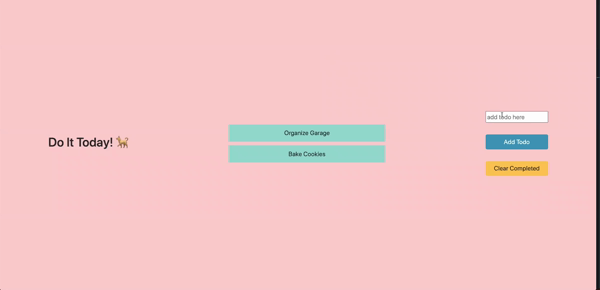

# React-Todo

This project is building a stateful class component. It allows users to add their to-do things, mark completed things and remove them.

## Instructions

- Default: there are two default to-do, it's removable
- Add todo: an input box at right bar allows you add things, hit "Add Todo", you can see your todo shows at the center
- Completed: click the todo card you just created, you'll see the the card was been marked with a line
- Clear: you can clear your completed todo by clicking "Clear Completed" at right bar

## Deploy

- You can check my deployment [Here](https://react-todo-j9x5od9yq.now.sh/).(https://react-todo-j9x5od9yq.now.sh/).
